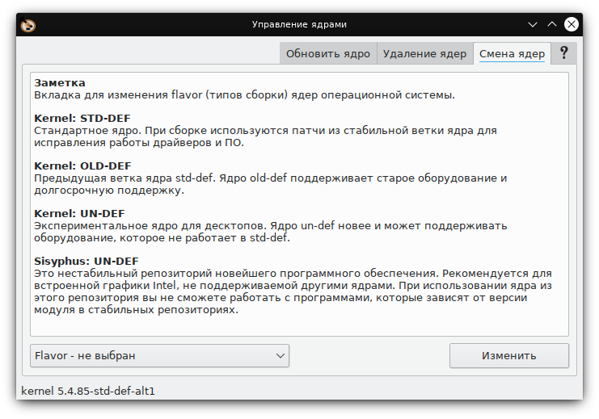
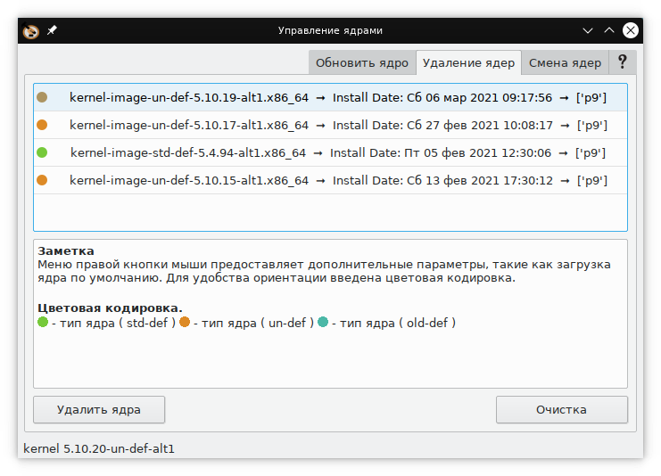

# Kernel Manage

**Source Code:** https://github.com/Koi-foo/kernel-manager.git

## Summary:
Program for updating kernels in altlinux p9

## Description:
Graphical shell for scripts: update-kernel, remove-old-kernels
Rendering the interface Qt5\PyQt5
Language logic Python 3
The program can update the kernel, change the build type, remove old kernels, clean the file storage, update the distribution.

## Translation of the program.
The program has been translated into Russian and English. The English version needs some work. Translation instructions are located in the locale directory of the root directory of kernel-manager.
### Thanks to the translators:
* gosts_87 - Дмитрий ( Chinese )

## Requires:
* python3-base
* python3-module-PyQt5
* python3-module-gettext
* xdg-utils
* update-kernel

## Install

* Recommended installation to /opt directory
* When changing directory, fix path in kernel-manager.desktop
```
/opt/kernel-manager
%_desktopdir/kernel-manager.desktop
```

## Changelog
* New version v1.6 Release

* New version v1.5

* New version v1.4

* New version v1.3

## Preview
<p align="center">
  
</p>

<p align="center">
  
</p>
